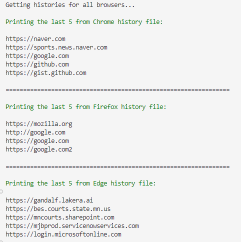

# Extracting Browser Histories

This is a PowerShell script that extracts browser histories from Chrome, Firefox, and Edge. Currently tested on Windows 10 Enterprise environment.

## Quick start

In a PowerShell session, run:

`.\get-history <number of last visits> <name of browser>`

If the number of last visits is not specified, it will search the last **20** visits by default.

If the name of a browser is not specified, it will run the search for all three browsers.  

For instance, `.\get-history 5` will give you this result:

## Supported browsers

- Google Chrome
- Firefox
- Microsoft Edge

## Limitations

- No access date information
- No sub-directory information
- Removing duplicate addresses from the history
    - The script will visit the list of visited addresses from the latest to remove the duplicates using a hash table. 

